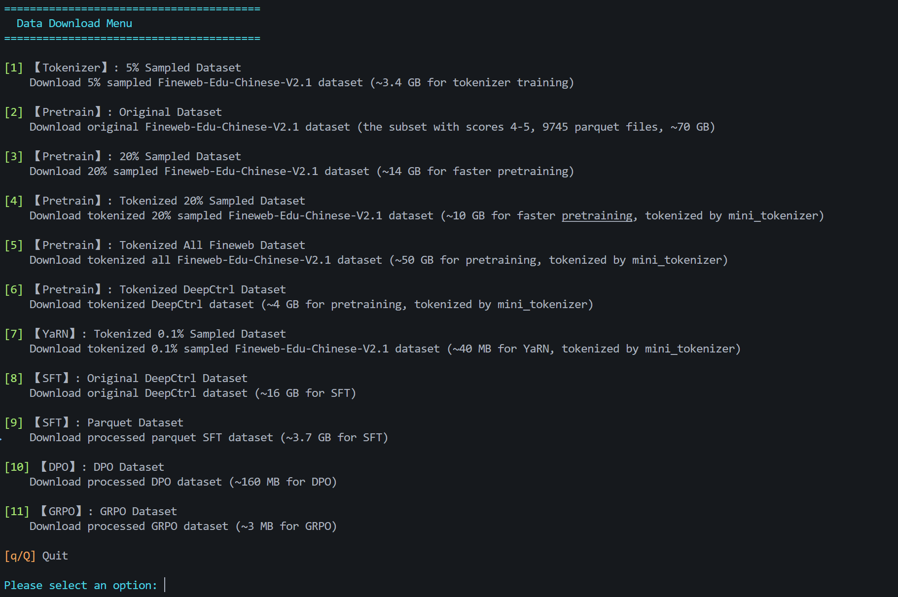
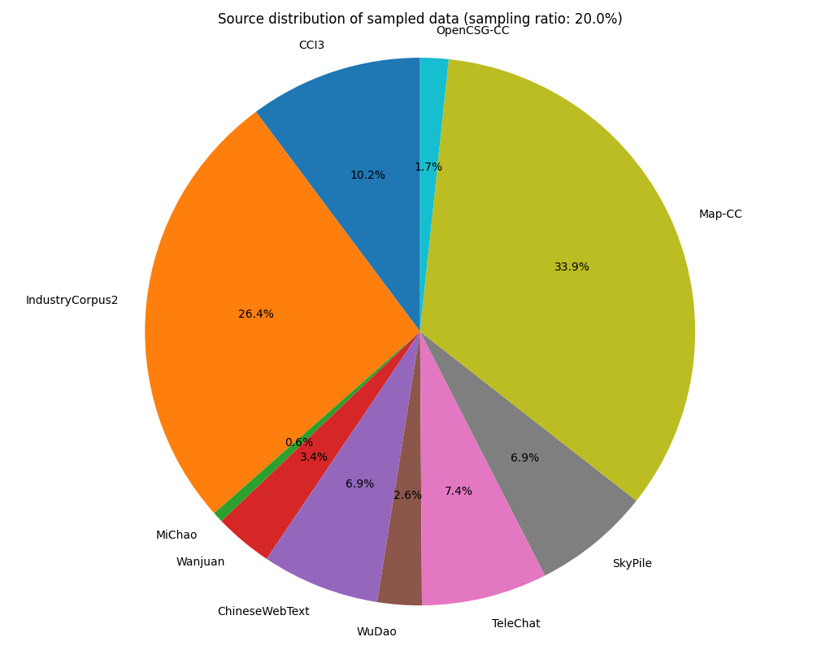
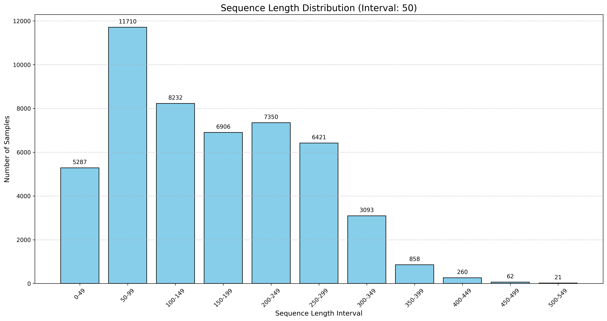
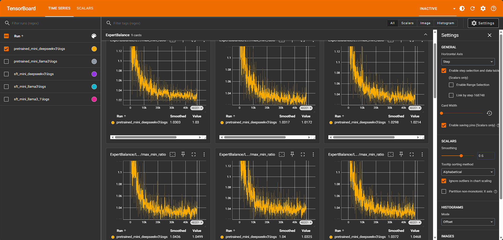
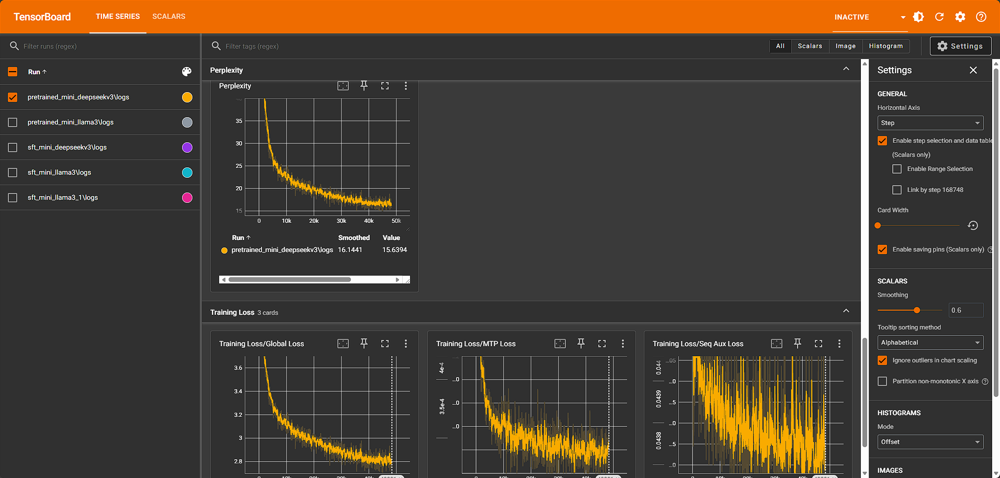
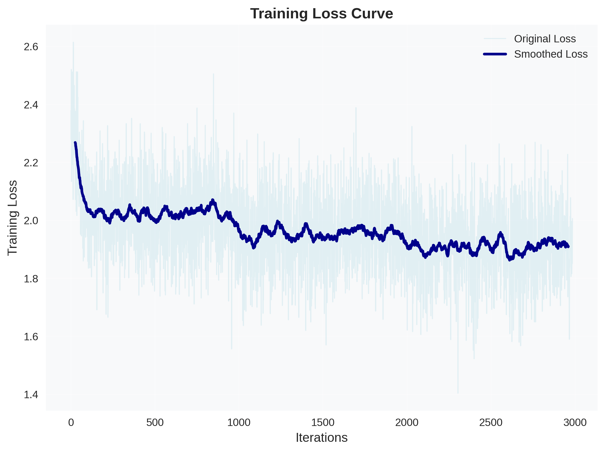
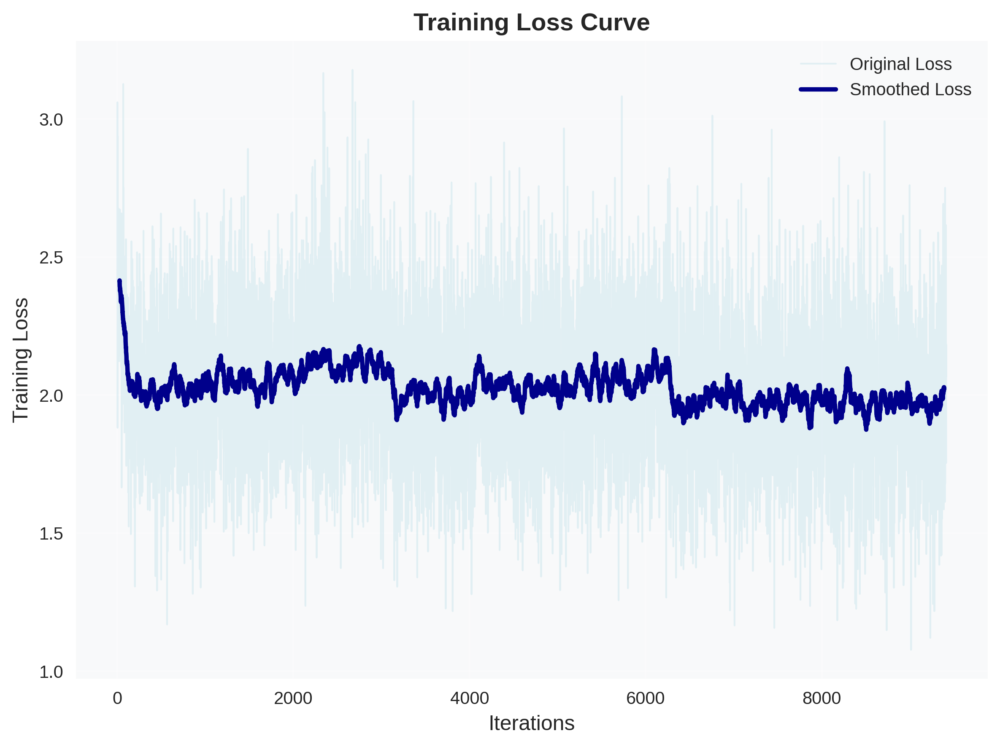

# Mini-LLM

<p align="center">
    
<p>

<p align="center">
        🤗 <a href="https://huggingface.co/WKQ9411">Hugging Face</a>&nbsp&nbsp | &nbsp&nbsp🤖 <a href="https://www.modelscope.cn/datasets/wangkunqing/mini_llm_dataset">ModelScope</a>&nbsp&nbsp
<br>
<a href="README_en.md">English</a>&nbsp&nbsp
</p>

# 更新日志

- [2026-02-01] 实现 `mini_qwen3_next`模型；优化多轮对话数据构造；优化 `mini_models`结构。
- [2025-12-29] 项目初始化；实现 `mini_llama3`、`mini_deepseekv3`模型；实现 pretrain、sft。

# 一、项目简介

本项目旨在基于较小的算力，复现当前主流开源模型的架构，实现一个 100-200M 参数量版本的迷你模型。项目将数据集、训练流程等基础设施尽可能固定下来，以便在学习新的模型架构时能够快速复现，从而将主要精力聚焦在模型架构的学习和复现上。

**主要目标：**
1. 学习并复现当前主流开源模型架构
2. 从零实现常用的训练和推理流程

为了实现这一目标，在先前版本的 Mini-LLM 中，我们完全自定义实现了 `model` 包，其中包括 `BaseModel` 和 `BaseModelArgs` 等基类。后来发现，这样的构建思路与 transformers 库的 `PreTrainedModel` 和 `PretrainedConfig` 类似。基于这种相似性，为了更好地与 HuggingFace 生态兼容，我们直接重构了项目结构。当前版本实现的模型完全兼容 transformers 库，可以直接使用 `from_pretrained`、`generate` 等方法进行模型加载和推理。同时，为了深入理解训练和推理原理，项目仍然提供了一套独立的训练代码和生成代码实现。早期版本的 Mini-LLM 现在移动到 legacy 分支。

# 二、如何从零一步一步复现本项目

## （一）环境配置

1. 克隆项目

```shell
git clone https://github.com/WKQ9411/Mini-LLM.git
cd Mini-LLM
```

2. 初始化环境

执行以下脚本，将自动检测环境并安装依赖。模型训练需要具有cuda环境，如果仅尝试使用训练好的权重进行推理，可以CPU环境。

```shell
# Linux
bash ./scripts/setup.sh

# Windows
.\scripts\setup.ps1
```

## （二）数据集准备

### 1. 数据集介绍

目前使用的数据集包括：

1. [OpenCSG Fineweb-Edu-Chinese-V2.1 数据集](https://huggingface.co/datasets/opencsg/Fineweb-Edu-Chinese-V2.1)

主要使用该数据集中得分为4-5分的高质量语料部分，共9745个parquet文件（编号是从0-9766，中间似乎有缺失编号，但从modelscope上确实下载的是9745个文件），总共约70GB。主要用途：
- 使用该数据集的5%采样作为tokenizer训练数据
- 使用该数据集的20%采样作为预训练数据
- 如果算力足够，也可采用全部数据进行预训练

2. [匠数科技大模型数据集](https://www.modelscope.cn/datasets/deepctrl/deepctrl-sft-data)

大约16GB，主要用途：
- 使用该数据集的全部作为预训练数据
- 采样50000条作为sft数据

### 2. 数据集准备

数据集相关脚本位于`scripts`文件夹中，可以通过以下命令下载需要的数据集：

```shell
# Linux
bash ./scripts/download_data.sh

# Windows
.\scripts\download_data.ps1
```

界面如下图所示，可选择需要下载的数据集序号进行下载：

<div align="center">

</div>


其中：

- [1] 下载按照5%的比例对OpenCSG Fineweb-Edu-Chinese-V2.1数据集进行采样的.parquet格式数据子集，用于训练tokenizer（你也可以直接使用训练好的tokenizer，文件位于项目的`mini_tokenizer`文件夹内）
- [2] 下载**原始**OpenCSG Fineweb-Edu-Chinese-V2.1数据集中得分4-5的全部.parquet文件，用于预训练
- [3] 下载按照20%的比例对OpenCSG Fineweb-Edu-Chinese-V2.1数据集进行采样的.parquet格式数据子集，用于预训练，采样按照类别等比例采样，分布与原始数据集一致：
<div align="center">

</div>

- [4] 下载按照20%的比例对OpenCSG Fineweb-Edu-Chinese-V2.1数据集进行采样的.bin格式数据子集，用于预训练（已通过`mini_tokenizer`处理为token ids）
- [5] 下载匠数科技大模型数据集的全部.bin格式数据文件，用于预训练（已通过`mini_tokenizer`处理为token ids）
- [6] 下载**原始**匠数科技大模型数据集的全部.jsonl格式数据文件，用于SFT
- [7] 下载经过处理的匠数科技大模型数据集的.parquet格式数据文件，用于SFT（已通过`mini_tokenizer`处理为token ids，其中包括：(a) 转化为parquet格式的全部符合条件的SFT数据；(b) 采样的50000条采样数据和200条自我认知数据；(c) 将 (b) 进行packing处理后的数据；推荐使用 (c) 进行SFT），采样后的数据长度分布如下：

<div align="center">

</div>

你可以选择直接下载处理好的数据进行训练（推荐），也可以选择下载原始数据自行处理，处理数据的代码位于：

```shell
./scripts/prepare_tokenizer_data.py
./scripts/prepare_pretrain_data.py
./scripts/prepare_sft_data.py
```

本项目当前使用：[1]训练tokenizer，[4]+[5]进行预训练（通过`prepare_pretrain_data.py`中的`merge_pretrain_data`函数合并.bin文件），[7]中的c.进行SFT。

## （三）训练tokenizer

新版本的mini_tokenizer与Qwen保持一致，使用的特殊token包括：`<|endoftext|>`, `<|im_start|>`, `<|im_end|>`, `<think>`, `</think>`。
基础词表大小为32000（包括`<|endoftext|>`），`<|im_start|>`, `<|im_end|>`, `<think>`, `</think>`作为added tokens添加到词表中，因此词表大小为32004（其中，`<think>`和`</think>`当前暂未使用，后续更新RL相关代码时考虑使用）。聊天模板位于`data/tokenizer_data/chat_template.jinja2`。当前的聊天模板仅基于`user`, `assistant`，并自动匹配`think`部分的内容。
可直接使用训练好的`mini_tokenizer`，或重新训练。重新训练执行：

```shell
python ./train/train_tokenizer.py
```

如果需要重新训练tokenizer，建议确保CPU具有较大的RAM，如果5%采样数据对于所训练的tokenizer仍然较大，可以在`scripts/prepare_tokenizer_data.py`中使用更小的`sample_ratio`采样更小一点的tokenizer数据集。

## （四）模型结构

模型结构参考论文、官方仓库源码、transformers实现等，其中的`hidden_states`形状统一为: `(B, H, L, D)`，其中`B`为batch size，`H`为头数，`L`为序列长度，`D`为每个头的维度。

模型结构参考本人 [github 博客](https://wkq9411.github.io/)：

> 博客中的 `mini_llama3` 和 `mini_deepseekv3` 的代码部分是基于早期版本的Mini-LLM实现的，与当前版本不完全一致，但核心思想是相同的。

1. `mini_llama3`，Dense Model:
   - [代码解读](https://wkq9411.github.io/2026-01-01/Code-Llama3.html)
2. `mini_deepseekv3`，MoE Model:
   - [论文解读](https://wkq9411.github.io/2026-01-01/Paper-DeepSeek-V3.html)
   - [代码解读](https://wkq9411.github.io/2026-01-01/Code-DeepSeek-V3.html)
3. `mini_qwen3_next`，Linear Model:
   - [论文解读 - Transformers are RNNs](https://wkq9411.github.io/2026-01-18/Paper-Transformers-are-RNNs.html)
   - [论文解读 - Gated Delta Network](https://wkq9411.github.io/2026-01-18/Paper-Gated-Delta-Network.html)
   - [论文解读 - Gated Attention](https://wkq9411.github.io/2026-01-18/Paper-Gated-Attention.html)

## （五）预训练

使用单卡进行训练：

```shell
python ./train/pretrain.py --model_name=mini_deepseekv3 --max_batch_size=32
```

使用 DDP 进行训练：

```shell
CUDA_VISIBLE_DEVICES=0,1 torchrun --nproc_per_node=2 ./train/pretrain.py --model_name=mini_deepseekv3 --max_batch_size=32
```

更多训练参数说明，请参考`train/pretrain.py`中的`parse_args()`函数。

训练开始后，在新的终端内开启tensorboard用于监控训练进度：

```shell
tensorboard --logdir=output/
```

如果使用的是云服务器，根据不同平台使用文档，配置tensorboard端口等参数和设置公开访问等，从而能够在本地监控训练进度，例如：

```bash
tensorboard --logdir=output/ --port=8080 --bind_all
```

训练会记录通用的`learing_rate`、`loss`、`ppl`等指标，此外，以`mini_deepseekv3`模型为例，还额外记录了包括**专家负载情况**、**序列级辅助损失**、**mtp损失**等指标，如下图所示：

<div align="center">

</div>

<div align="center">

</div>

> 其中，专家负载曲线通过记录每层的所有专家最大/最小激活次数的比值，趋近于1表示负载均衡，越大表示负载不均衡。

## （六）SFT

由于模型参数量基本在100-200M，SFT训练数据又相对较少，仅使用单卡训练即可：

```shell
python ./train/sft.py --model_name=mini_deepseekv3 --max_batch_size=32
```

更多训练参数说明，请参考`train/sft.py`中的`parse_args()`函数。

SFT dataset可选择是否使用packing数据集，开启packing后，能够有效利用算力，同时让每个batch的实际有效token长度尽可能一致，从而避免梯度稀释问题。使用packing后，每个batch需要构造相应的`attention_mask`，可视化如下（pack了两条数据）：

<div align="center">

</div>

packing后，sft曲线相对更加平滑。
- packing的曲线：
<div align="center">

</div>

- 未packing的曲线：
<div align="center">

</div>

## （七）推理

相关推理demo的代码位于`example`文件夹中，可以使用项目自定义的`Generator`类进行推理，也可以使用transformers原生的`generate`方法进行推理。

在终端中运行：

```shell
python ./example/test_terminal.py --model_name=mini_deepseekv3
```

更多推理参数说明，请参考`example/test_terminal.py`中的`parse_args()`函数。

也可以通过API方式进行推理，提供给流行的前端进行对话（通过`wrap-openai`封装openai兼容api，可参考我的另一个仓库[wrap-openai](https://github.com/WKQ9411/wrap-openai)），通过如下命令启动后端：

```shell
python ./example/test_api.py --model_name=mini_deepseekv3
```

以[CherryStudio](https://www.cherry-ai.com/)为例，配置好OpenAI兼容API后，对话效果如下：

<div align="center">

</div>

此外，本项目的模型参数已上传至HuggingFace，可直接下载使用，调用方法见`example/use_example.ipynb`。

> 由于模型参数量较小，虽然可能一定程度上较好的预测下一个token，但是并不等同于它具备了良好的泛化能力、知识储备或推理能力。小模型更容易“记住”训练数据中的表面模式（比如特定短语、句子结构、格式），而不是真正“理解”其含义。这导致它们在面对需要知识、推理或稍微偏离训练模式的prompt时，容易产生幻觉和不连贯的输出。