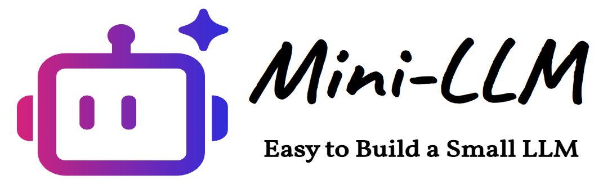

<p align="center">
    
</p>

## 更新内容

- 持续更新中...

- 2025.05.20：
  
  - 初步整理完代码，当前模型包括：
    
    - mini_deepseekv3
    - mini_llama3
  
  - 训练流程代码包括：

    - Pretrain
    - SFT

## 简介

本项旨在基于较小的算力，实现基本的DeepSeek-V3训练和推理Demo，并编写一个**能够复用的Demo框架**。因此，本项目将数据集、训练流程等尽可能固定下来，未来在需要学习新的模型架构时，只需将手撕代码放在model文件夹中即可，从而能够将主要精力聚焦在模型架构的学习上。

若需要增加模型，模型文件需要有以下结构：

```python
@dataclass
class DeepSeekV3ModelArgs(BaseModelArgs):
    ...
    
class DeepSeekV3Model(BaseModel):
    model_name = "mini_deepseekv3"
    
    def __init__():
        ...
    
    def forward():
        return logits, loss, other_vars
```

模型参数配置和模型类使用`{ModelName}ModelArgs`和`{ModelName}Model`命名，继承`basemodel.py`中的`BaseModelArgs`和`BaseModel`。模型类需要添加类属性`model_name`，`__init__.py`会自动发现模型并注册到包中。模型类的返回需包括`logits, loss, other_vars`，其中`other_vars`用于自定义需要外部监控的变量，监控时只需稍微修改训练代码，打印输出或写入到`tensorboard`即可，由用户自己定义。

## （一）数据集

tokenizer训练数据集：
- 经过预处理的中文维基百科数据集 https://hf-mirror.com/datasets/pleisto/wikipedia-cn-20230720-filtered

预训练数据集：
- 序列猴子数据集【大约7.8B token，主要基于该数据集训练】 https://github.com/mobvoi/seq-monkey-data/blob/main/docs/pretrain_open_corpus.md
- 经过预处理的中文维基百科数据集【大约0.12B token，可用于快速测试Demo】 https://hf-mirror.com/datasets/pleisto/wikipedia-cn-20230720-filtered

SFT数据集：匠数科技大模型sft数据集 https://www.modelscope.cn/datasets/deepctrl/deepctrl-sft-data/files

## （二）使用

下载项目后，进入到项目根目录下。

### 1. 安装依赖

```bash
pip install -r requirements.txt
```

### 2. 预处理数据

预训练时，将预训练数据集放于`./preprocess_data/data/pretrain_data/`下。

SFT时，将SFT数据集放于`./preprocess_data/data/sft_data/`下。

进入到`preprocess_data`目录下执行：

```bash
cd ./preprocess_data
python preprocess_data.py
```

用于将原始文件分词并转换为`token id`，以`.bin`的格式保存。序列猴子数据集大致需要3个小时，如果不想等待，也可下载我在modelscope上传到处理好的`.bin`文件(地址：https://www.modelscope.cn/datasets/wangkunqing/mini_llm_pretrain_data)。同样在`preprocess_data`目录下，可直接执行以下相应命令即可：

```bash
bash ./download_pretrain_data.sh
bash ./download_sft_data.sh
bash ./download_tokenizer_data.sh
```

### 3. 训练

#### （1）训练tokenizer

tokenizer采用字节级BPE，使用wikipedia进行训练，词表大小设置为32k，执行如下代码：

```bash
python train_tokenizer.py
```

也可以使用其他数据集来训练，只需修改代码中的数据集路径，并修改读取数据相关的代码即可。也可以直接使用本项目训练好的mini_tokenizer。

#### （2）预训练

使用单卡进行训练：

```bash
python pretrain.py --model_name=mini_deepseekv3 --max_batch_size=18
```

其他参数请查看`pretrain.py`代码，或使用`--help`查看。

使用 DDP 进行训练：

```bash
torchrun --nproc_per_node=2 pretrain.py --model_name=mini_deepseekv3 --max_batch_size=18
```

训练开始后，在新的终端内开启tensorboard用于监控训练进度：

```bash
tensorboard --logdir=output/
```

如果使用的是云服务器，根据不同平台使用文档，配置tensorboard端口等参数和设置公开访问等，例如：

```bash
tensorboard --logdir=output/ --port=8080 --bind_all
```

#### （3）SFT

由于模型参数量基本在100-200M，SFT训练数据又相对较少，仅使用单卡训练即可：

```bash
python sft.py --model_name=mini_deepseekv3 --max_batch_size=18
```

### 4. 推理

可使用`test.py`在终端中进行简单测试，注意修改其中的模型权重和配置文件路径：

```bash
python test.py
```

或使用streamlit展现一个更加友好的UI来推理：

```bash
streamlit run run_model.py
```

注意，将`run_model.py`中的模型权重和配置文件路径修改为自己的模型权重和配置文件路径：

```bash
MODEL_CONFIG_DEFINITIONS = {
    "mini_deepseekv3": {
        "path": "your/path/to/mini_deepseekv3.pt",
        "yaml": "your/path/to/mini_deepseekv3_args.yaml",
        "inference_args": {"use_noaux_tc": True},
        "description": "MoE",
    },
    "mini_llama3": {
        "path": "your/path/to/mini_llama3.pt",
        "yaml": "your/path/to/mini_llama3_args.yaml",
        "inference_args": {},
        "description": "Dense",
    },
}
```

## （三）结果

最后需说明的是，100-200M的模型容量较小，虽然可能一定程度上较好的预测下一个词，但是并不等同于它具备了良好的泛化能力、知识储备或推理能力。小模型更容易“记住”训练数据中的表面模式（比如特定短语、句子结构、格式），而不是真正“理解”其含义。这导致它们在面对需要知识、推理或稍微偏离训练模式的prompt时，容易产生幻觉和不连贯的输出。

## （四）演示

https://github.com/user-attachments/assets/af546e22-5c8a-4524-9bad-746909ed49d5
