# Mini-LLM

<p align="center">
   
</p>

<div align="center" style="line-height: 1;">
  <a href="https://huggingface.co/WKQ9411">
    
  </a>
  <a href="https://www.modelscope.cn/datasets/wangkunqing/mini_llm_dataset">
    
  </a>
  <a href="./assets/wechat.png">
    
  </a>
  <br>
  <a href="README.md">
    
  </a>
</div>

# Changelog

- [2026-04-19] Added YaRN, DPO, and GRPO.
- [2026-02-01] Implemented `mini_qwen3_next` model; optimized multi-turn conversation data construction; optimized `mini_models` structure.
- [2025-12-29] Refactored the project for transformers compatibility; implemented `mini_llama3` and `mini_deepseekv3` models; implemented pretrain and SFT.

# I. Project Introduction

This project aims to replicate mainstream open-source model architectures with limited computational resources, implementing mini models with 100-200M parameters. The project fixes datasets, training pipelines, and other infrastructure as much as possible, so that when learning new model architectures, they can be quickly reproduced, allowing the main focus to be on learning and reproducing model architectures.

**Main Goals:**
1. Learn and reproduce mainstream open-source model architectures
2. Implement common training and inference pipelines from scratch

To achieve this goal, in previous versions of Mini-LLM, we fully customized the `model` package, including base classes such as `BaseModel` and `BaseModelArgs`. Later, we discovered that this approach is similar to transformers library's `PreTrainedModel` and `PretrainedConfig`. Based on this similarity, to better integrate with the HuggingFace ecosystem, we directly refactored the project structure. The current version's models are fully compatible with the transformers library and can directly use methods like `from_pretrained`, `generate` for model loading and inference. At the same time, to deeply understand the principles of training and inference, the project still provides a set of independent training code and generation code implementations. The early version of Mini-LLM has been moved to the legacy branch.

# II. How to Reproduce This Project from Scratch Step by Step

## (I) Environment Setup

1. Clone the project

```shell
git clone https://github.com/WKQ9411/Mini-LLM.git
cd Mini-LLM
```

2. Initialize environment

Execute the following script to automatically detect the environment and install dependencies. Model training requires a CUDA environment. If you only want to try inference with pre-trained weights, a CPU environment is sufficient.

```shell
# Linux
bash ./scripts/setup.sh

# Windows
.\scripts\setup.ps1
```

## (II) Dataset Preparation

### 1. Dataset Introduction

Currently used datasets include:

1. [OpenCSG Fineweb-Edu-Chinese-V2.1 Dataset](https://huggingface.co/datasets/opencsg/Fineweb-Edu-Chinese-V2.1)

Mainly using the high-quality corpus portion with scores of 4-5 from this dataset, totaling 9745 parquet files (numbered from 0-9766, with some missing numbers in between, but 9745 files are indeed downloaded from modelscope), approximately 70GB in total. Main uses:
- Use 5% sampling of this dataset as tokenizer training data
- Use 20% sampling of this dataset as pre-training data
- If computational resources are sufficient, the full dataset can also be used for pre-training
- Use 0.1% sampling of this dataset as YaRN fine-tuning data

2. [DeepCtrl Large Model Dataset](https://www.modelscope.cn/datasets/deepctrl/deepctrl-sft-data)

Approximately 16GB, main uses:
- Use the entire dataset as pre-training data
- Sample 50,000 entries as SFT data

3. [OpenCSG UltraFeedback-chinese Dataset](https://huggingface.co/datasets/opencsg/UltraFeedback-chinese)

The `ultrafeedback-chinese-binarized-lowest` subset is used as the DPO dataset. Training subsets can be selected according to the DPO score range.

4. A self-synthesized GRPO dataset.

The dataset is synthesized with Gemini 3.1 Pro. The task is to repair or modify JSON format, and each sample contains `prompt`, `thinking`, and `response`. The `prompt` gives a simple JSON with errors or modification requirements, `thinking` is the synthesized chain of thought, and `response` is the JSON output without extra explanations.

### 2. Dataset Preparation

Dataset-related scripts are located in the `scripts` folder. You can download the required datasets using the following commands:

```shell
# Linux
bash ./scripts/download_data.sh

# Windows
.\scripts\download_data.ps1
```

The interface is shown in the figure below, where you can select the dataset number to download:

<div align="center">
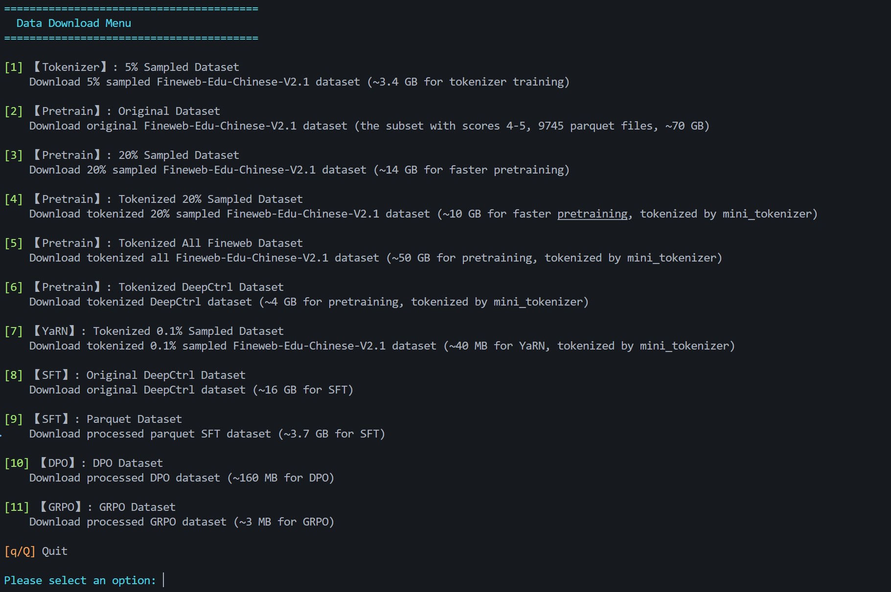
</div>

Among them:

- [1] [Tokenizer] Download a .parquet format data subset sampled at 5% from the OpenCSG Fineweb-Edu-Chinese-V2.1 dataset for training tokenizer (you can also directly use the pre-trained tokenizer, located in the project's `mini_tokenizer` folder)
- [2] [Pretrain] Download **all original** .parquet files with scores 4-5 from the OpenCSG Fineweb-Edu-Chinese-V2.1 dataset for pre-training
- [3] [Pretrain] Download a .parquet format data subset sampled at 20% from the OpenCSG Fineweb-Edu-Chinese-V2.1 dataset for pre-training. Sampling is done proportionally by category, maintaining the same distribution as the original dataset:
<div align="center">
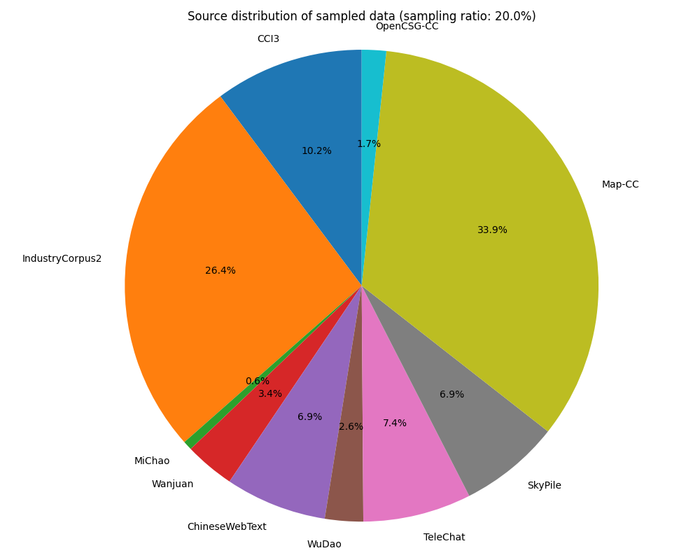
</div>

- [4] [Pretrain] Download a .bin format data subset sampled at 20% from the OpenCSG Fineweb-Edu-Chinese-V2.1 dataset for pre-training (processed into token ids by `mini_tokenizer`)
- [5] [Pretrain] Download all .bin format data files with scores 4-5 from the OpenCSG Fineweb-Edu-Chinese-V2.1 dataset for pre-training (processed into token ids by `mini_tokenizer`)
- [6] [Pretrain] Download all .bin format data files from the DeepCtrl large model dataset for pre-training (processed into token ids by `mini_tokenizer`)
- [7] [YaRN] Download a .bin format data subset sampled at 0.1% from the OpenCSG Fineweb-Edu-Chinese-V2.1 dataset for YaRN fine-tuning (processed into token ids by `mini_tokenizer`)
- [8] [SFT] Download **all original** .jsonl format data files from the DeepCtrl large model dataset for SFT
- [9] [SFT] Download processed .parquet format data files from the DeepCtrl large model dataset for SFT (processed into token ids by `mini_tokenizer`, including: (a) all eligible SFT data converted to parquet format; (b) sampled 50,000 entries and 200 self-awareness entries; (c) data after packing (b); it is recommended to use (c) for SFT). The length distribution of sampled data is as follows:

<div align="center">
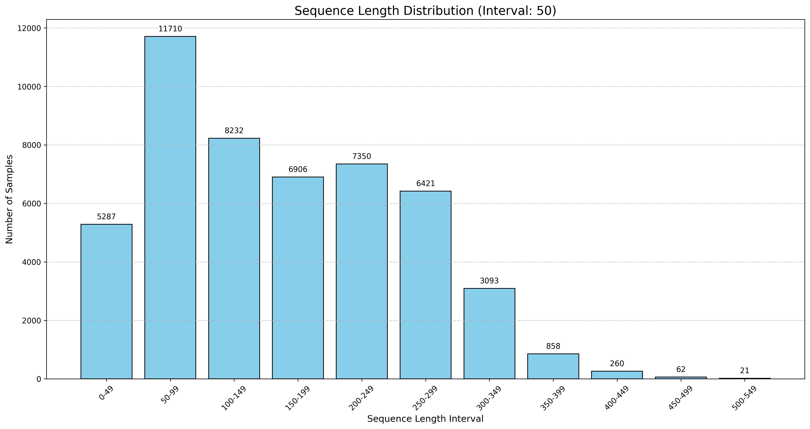
</div>

- [10] [DPO] Download the processed DPO dataset
- [11] [GRPO] Download the synthesized GRPO dataset

You can choose to directly download processed data for training (recommended), or download raw data and process it yourself. Data processing code is located at:

```shell
./scripts/prepare_tokenizer_data.py
./scripts/prepare_pretrain_data.py
./scripts/prepare_sft_data.py
./scripts/prepare_dpo_data.py
./scripts/prepare_grpo_data.py
```

This project currently uses: [1] for training tokenizer, [4]+[6] for pre-training (merge .bin files through the `merge_pretrain_data` function in `prepare_pretrain_data.py`), and (c) from [9] for SFT.

## (III) Training Tokenizer

The new version of mini_tokenizer is consistent with Qwen, using special tokens including: `<|endoftext|>`, `<|im_start|>`, `<|im_end|>`, `<think>`, `</think>`.
The base vocabulary size is 32,000 (including `<|endoftext|>`), and `<|im_start|>`, `<|im_end|>`, `<think>`, `</think>` are added as added tokens to the vocabulary, so the vocabulary size is 32,004. Tokenizer usage can be found in `example/tokenizer_example.ipynb`. The chat template is located at `data/tokenizer_data/chat_template.jinja2`.
You can directly use the pre-trained `mini_tokenizer`, or retrain it. To retrain, execute:

```shell
python ./train/train_tokenizer.py
```

If you need to retrain the tokenizer, it is recommended to ensure the CPU has sufficient RAM. If 5% sampled data is still too large for the tokenizer being trained, you can use a smaller `sample_ratio` in `scripts/prepare_tokenizer_data.py` to sample a smaller tokenizer dataset.

## (IV) Model Architecture

Model architecture references papers, official repository source code, transformers implementations, etc. The `hidden_states` shape is unified as: `(B, H, L, D)`, where `B` is batch size, `H` is the number of heads, `L` is sequence length, and `D` is the dimension per head.

For model architecture, please refer to my [GitHub Blog](https://wkq9411.github.io/):

> The code sections for `mini_llama3` and `mini_deepseekv3` in the blog are based on earlier versions of Mini-LLM. While they are not fully consistent with the current version, the core concepts are the same.

1. `mini_llama3`, Dense Model:
   - [Code Analysis](https://wkq9411.github.io/2026-01-01/Code-Llama3.html)
2. `mini_deepseekv3`, MoE Model:
   - [Paper Analysis](https://wkq9411.github.io/2026-01-01/Paper-DeepSeek-V3.html)
   - [Code Analysis](https://wkq9411.github.io/2026-01-01/Code-DeepSeek-V3.html)
3. `mini_qwen3_next`, Linear Model:
   - [Paper Analysis - Transformers are RNNs](https://wkq9411.github.io/2026-01-18/Paper-Transformers-are-RNNs.html)
   - [Paper Analysis - Gated Delta Network](https://wkq9411.github.io/2026-01-18/Paper-Gated-Delta-Network.html)
   - [Paper Analysis - Gated Attention](https://wkq9411.github.io/2026-01-18/Paper-Gated-Attention.html)

## (V) Pre-training

Training with a single GPU:

```shell
python ./train/pretrain.py --model_name=mini_deepseekv3 --max_batch_size=32
```

Training with DDP:

```shell
CUDA_VISIBLE_DEVICES=0,1 torchrun --nproc_per_node=2 ./train/pretrain.py --model_name=mini_deepseekv3 --max_batch_size=32
```

For more training parameter descriptions, please refer to the `parse_args()` function in `train/pretrain.py`.

After training starts, open tensorboard in a new terminal to monitor training progress:

```shell
tensorboard --logdir=output/
```

If using a cloud server, configure tensorboard port and other parameters and set public access according to different platform documentation, so that training progress can be monitored locally, for example:

```bash
tensorboard --logdir=output/ --port=8080 --bind_all
```

Training records common metrics such as `learning_rate`, `loss`, `ppl`, etc. In addition, taking the `mini_deepseekv3` model as an example, it also records additional metrics including **expert load balancing**, **sequence-level auxiliary loss**, **mtp loss**, etc., as shown in the following figures:

<div align="center">
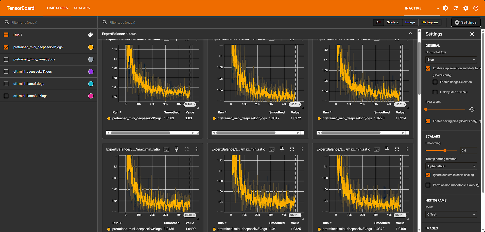
</div>

<div align="center">
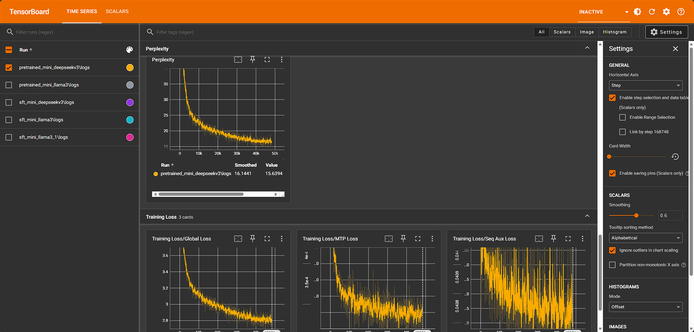
</div>

> Among them, the expert load curve records the ratio of maximum/minimum activation counts of all experts in each layer. A value approaching 1 indicates load balancing, and larger values indicate load imbalance.

## (VI) SFT

Since the model parameters are basically 100-200M and SFT training data is relatively small, single GPU training is sufficient:

```shell
python ./train/sft.py --model_name=mini_deepseekv3 --max_batch_size=32
```

For more training parameter descriptions, please refer to the `parse_args()` function in `train/sft.py`.

SFT dataset can choose whether to use packing dataset. After enabling packing, computational resources can be effectively utilized, and the actual effective token length of each batch can be as consistent as possible, thereby avoiding gradient dilution issues. After using packing, each batch needs to construct the corresponding `attention_mask`, visualized as follows (packed two entries):

<div align="center">
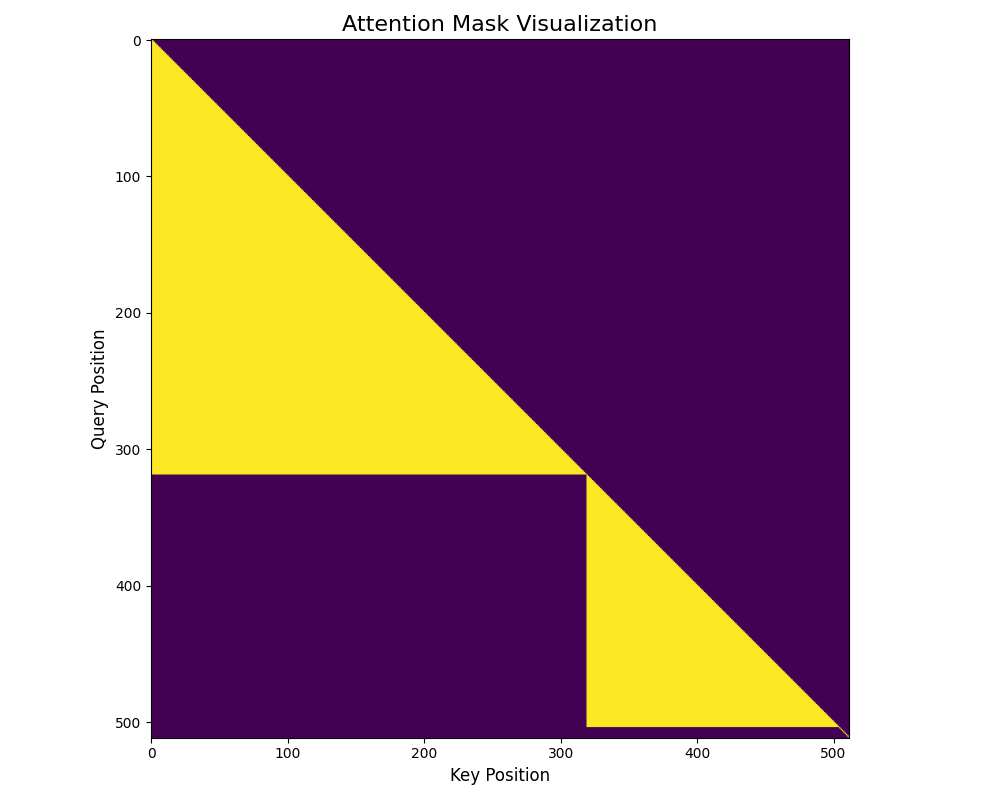
</div>

After packing, the SFT curve is relatively smoother.
- Packing curve:
<div align="center">
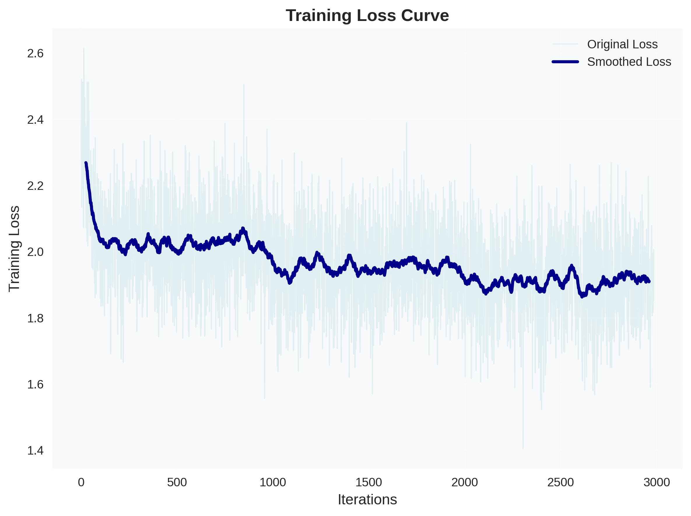
</div>

- Unpacked curve:
<div align="center">
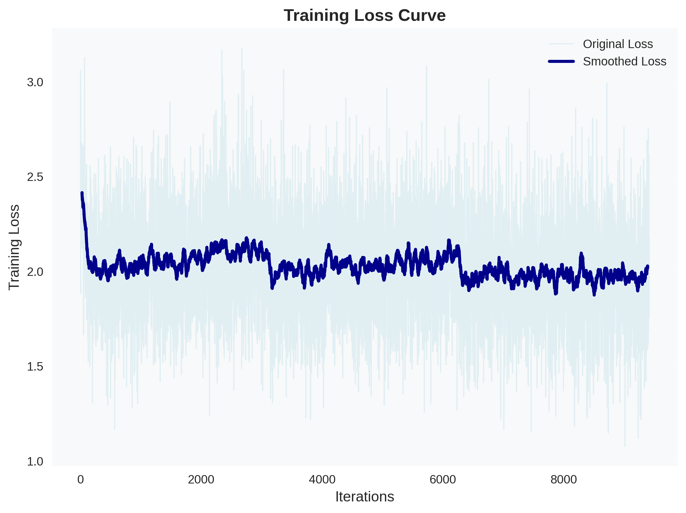
</div>

> Due to the characteristics of Linear Models, packing SFT for `mini_qwen3_next` is currently not supported. See [Issues #3](https://github.com/WKQ9411/Mini-LLM/issues/3).

## (VII) YaRN

For the theoretical part of YaRN, please refer to the blog: [YaRN Paper Notes](https://wkq9411.github.io/2026-01-01/Paper-YaRN.html)

Pass the `rope_scaling` parameter into the model configuration, for example:

```python
rope_scaling = {
   "rope_type": "yarn",
   "factor": 4.0,
   "attention_factor": None,  # Defaults to None and is calculated internally
   "beta_fast": 32,
   "beta_slow": 1,
}
```

Optionally fine-tune on a small amount of long-text data:

```shell
python ./train/yarn.py --model_name mini_llama3 --max_seq_len 2048
```

For more training parameter descriptions, please refer to the `parse_args()` function in `train/yarn.py`.

To evaluate long-text PPL under three settings: before adding YaRN, adding YaRN without fine-tuning, and adding YaRN with fine-tuning:

```shell
python ./eval/eval_yarn.py --base_model_path output/pretrained_mini_llama3 --yarn_finetuned_model_path output/yarn_mini_llama3
```

The results are as follows:

<div align="center">
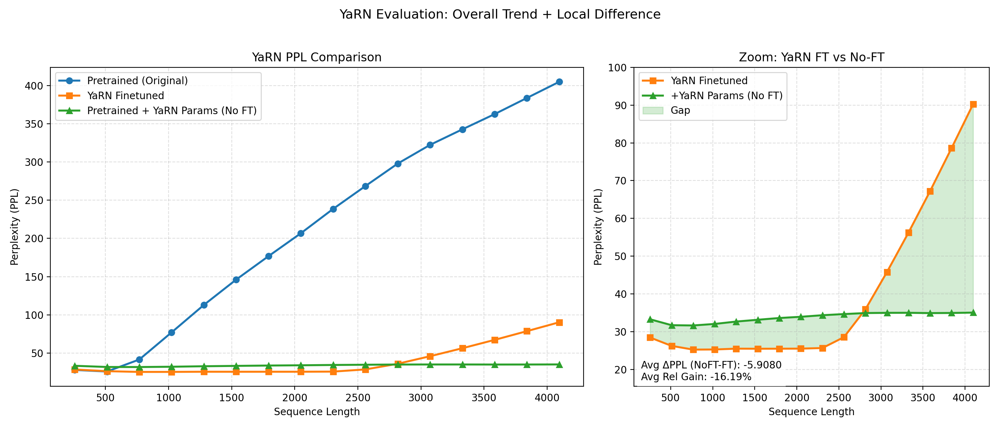
</div>

It can be seen that after adding YaRN, long-text PPL decreases significantly compared with the original model. In addition, after adding YaRN and fine-tuning, long-text PPL decreases further. However, outside the fine-tuning length range, PPL gradually rises. This may be because the fine-tuned model has learned new positional encoding semantics, making its extrapolation ability weaker than the model that only inserts YaRN without additional fine-tuning. Therefore, if the target is long-text modeling within a fixed length range, fine-tuning on a small amount of long-text data can be used; if extrapolation beyond the training length is more important, YaRN can be inserted only during inference or evaluation without extra fine-tuning.

## (VIII) DPO

For the theoretical part of DPO, please refer to the blog: [DPO Paper Notes](https://wkq9411.github.io/2026-03-11/Paper-DPO.html)

Run the following command:

```shell
python ./train/dpo.py --model_name mini_llama3
```

For more training parameter descriptions, please refer to the `parse_args()` function in `train/dpo.py`. Since DPO can easily destabilize small models, smaller learning rates and a smaller $\beta$ are usually used. In addition, optional optimizations such as DPOP, parameter freezing, and SFT on chosen responses before DPO are provided.

DPOP is a variant of DPO. It adds a positive constraint term for the chosen response after the DPO loss: when the policy model assigns a lower log probability to the chosen response than the reference model, an extra penalty `lambda * max(ref_chosen_logp - policy_chosen_logp, 0)` is added. This prevents the model from lowering the probability of the chosen response itself while trying to enlarge the preference gap between chosen and rejected responses. In this project's small-model setting, DPOP is usually more stable than direct DPO, and can be enabled with `--loss_type dpop --dpop_lambda 1.0`.

DPO training results are as follows:

<div align="center">
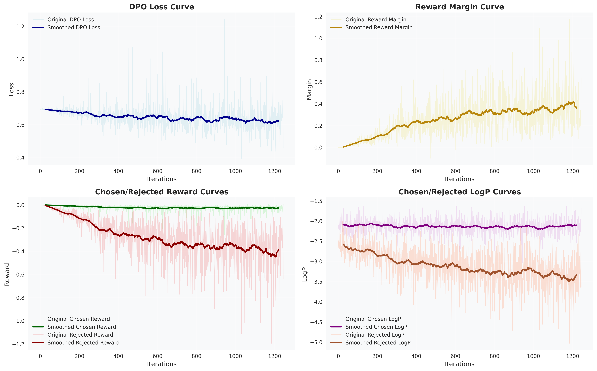
</div>

For detailed comparisons, please refer to `eval/eval_dpo.ipynb`.

## (IX) GRPO

For the theoretical part of GRPO, please refer to the blog: [From Policy Gradient to PPO and GRPO](https://wkq9411.github.io/2026-03-22/RL-PG-PPO-GRPO.html)

The GRPO example task in this project is JSON repair or modification: given an erroneous JSON or a modification request in the prompt, the model first gives a short reasoning process in `<think>...</think>`, and then outputs the final JSON in a fenced JSON code block. During cold start, to preserve a certain level of instruction-following ability and avoid the loss quickly collapsing into the narrow distribution of the JSON task, a portion of general data is added. The final cold-start data contains 800 general samples and 1200 JSON task samples.

The current reward function mainly consists of four parts: output format reward, thinking length reward, JSON parseability reward, and correctness reward. The correctness reward has the highest weight and encourages the model to output JSON consistent with the ground truth; the other rewards constrain the output structure to prevent small models from producing unparsable or malformed outputs during RL.

Run the following command:

```shell
python ./train/grpo.py --model_name mini_llama3 --max_batch_size 4 --cold_start_sft --sft_batch_size 16 --sft_epochs 3 --grpo_epochs 2
```

For more training parameter descriptions, please refer to the `parse_args()` function in `train/grpo.py`. By default, GRPO loads the SFT model from `output/sft_{model_name}` as the initial policy. When `--cold_start_sft` is enabled, it first runs task-format cold-start SFT using `data/grpo_data/cold_start.jsonl`, and then enters GRPO training. If you want to continue pre-training on the JSON task corpus, you can also enable `--mid_training` (although the effect may be limited).

Training results are as follows:

<div align="center">
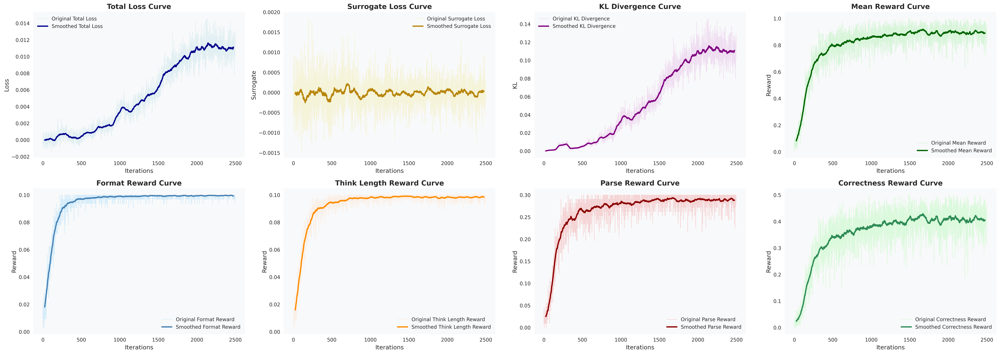
</div>

The results show that after GRPO, the model further improves in format following and JSON parseability, and the correctness is significantly better than using cold-start SFT only. For detailed comparisons, please refer to `eval/eval_grpo.ipynb`.

## (X) Inference

Inference demo code is located in the `example` folder. You can use the project's custom `Generator` class for inference, or use transformers' native `generate` method for inference.

Run in terminal:

```shell
python ./example/test_terminal.py --model_name=mini_deepseekv3
```

For more inference parameter descriptions, please refer to the `parse_args()` function in `example/test_terminal.py`.

You can also perform inference via API, providing it to popular frontends for dialogue (wrapped with `wrap-openai` to provide OpenAI-compatible API, you can refer to my other repository [wrap-openai](https://github.com/WKQ9411/wrap-openai)). Start the backend with the following command:

```shell
python ./example/test_api.py --model_name=mini_deepseekv3
```

Taking [CherryStudio](https://www.cherry-ai.com/) as an example, after configuring the OpenAI-compatible API, the dialogue effect is as follows:

<div align="center">

</div>

In addition, the model parameters of this project have been uploaded to HuggingFace and can be directly downloaded and used. Usage methods can be found in `example/use_example.ipynb`.

> Due to the small model parameter size, while it may predict the next token relatively well to some extent, this does not mean it has good generalization ability, knowledge base, or reasoning ability. Small models are more likely to "remember" surface patterns in training data (such as specific phrases, sentence structures, formats) rather than truly "understand" their meaning. This causes them to easily produce hallucinations and incoherent outputs when facing prompts that require knowledge, reasoning, or slightly deviate from training patterns.

# Star History

<div align="center">
  <a href="https://www.star-history.com/?repos=WKQ9411%2FMini-LLM&type=date&logscale=&legend=top-left">
    <picture>
      <source media="(prefers-color-scheme: dark)" srcset="https://api.star-history.com/chart?repos=WKQ9411/Mini-LLM&type=date&theme=dark&legend=top-left" />
      <source media="(prefers-color-scheme: light)" srcset="https://api.star-history.com/chart?repos=WKQ9411/Mini-LLM&type=date&legend=top-left" />
      
    </picture>
  </a>
</div>

